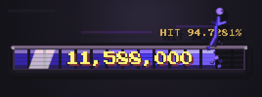

# OpenCode Token Overlay

一个面向 macOS 的轻量 Electron 桌面悬浮窗，实时展示 OpenCode V2 当日 Token 总消耗。

<p align="center">
  
  <br />
  <sub>演示数据仅用于展示动画；正式运行时只显示 OpenCode V2 返回的真实 Usage。</sub>
</p>

## 功能

- 透明、无边框、置顶并可拖拽
- 自动发现本地 OpenCode V2 后台服务
- 通过 HTTP API 汇总当天 Token
- 订阅 `/api/event` 实时接收 Usage 更新
- 1980 年代街机像素 HUD、随机主题色、呼吸和爆满动画
- 每 100,000 Token 填满一轮进度条
- 显示值最高以 10,000 Token/秒追赶真实值
- 右上角显示当天缓存命中率
- 当前角色跟随真实进度前沿运动，满条后播放专属回吹动画
- 内置 10 个可轮换角色，每跑完 100,000 Token 自动切换下一个
- 角色落地后统一碎成主题色像素粒子，再由粒子重组成下一个角色
- 正常增长时显示随机风线、像素木屑与命中火花
- 可直接回答 Question，并审批 `ONCE / ALWAYS / REJECT` Permission

## 源码安装

要求：

- macOS
- Node.js 22.12.0 或更高版本
- 已安装并运行过 OpenCode V2

```bash
git clone https://github.com/rUrU516/opencode-token-overlay.git
cd opencode-token-overlay
npm ci
npm run service:install
```

`service:install` 会安装当前用户的 macOS LaunchAgent：登录时自动启动，进程意外退出后自动拉起，并将运行日志写入 `~/Library/Logs/OpenCodeTokenOverlay/`。

常用管理命令：

```bash
npm run service:status
npm run service:restart
npm run service:stop
npm run service:start
npm run service:logs
npm run service:uninstall
```

`service:stop` 只停止当前登录会话；下次登录仍会自动启动。`service:uninstall` 会停止并删除 LaunchAgent。托管模式下点击悬浮窗的 `×` 后，`launchd` 会自动将它重新拉起。

## 手动运行

不安装 LaunchAgent 时，可以独立后台启动：

```bash
npm run launch
```

重复执行不会创建第二个实例。停止或重启：

```bash
npm run stop
npm run restart
```

前台调试运行：

```bash
npm start
```

手动运行模式下，也可以将鼠标移到悬浮窗上，点击左下角出现的 `×` 退出。

## 更新

在仓库目录执行：

```bash
git pull --ff-only
npm ci
npm run service:restart
```

## 排查

如果 HUD 变灰，先检查 OpenCode V2 后台服务：

```bash
opencode2 service status
opencode2 api get /api/health
```

必要时重启服务：

```bash
opencode2 service restart
```

检查悬浮窗 JavaScript：

```bash
npm run check
```

查看 LaunchAgent 状态与运行日志：

```bash
npm run service:status
npm run service:logs
```

## 数据口径

启动时通过 `/api/session` 和 `/api/session/{id}/message` 汇总本地时区当天用量，随后订阅 `/api/event` 中的 `session.usage.updated` 事件。首次加载直接显示今日基线，后续增量进入动画队列。

当天缓存命中率按提示词缓存的通用口径计算：

```text
cache read / (input + cache read + cache write)
```

普通输入和缓存写入均属于本次没有直接命中缓存的输入 Token；输出与推理 Token 不参与计算。

## 自定义角色

角色通过 `characters/character-framework.js` 注册，统一支持 `idle / run / resist / launch / tumble / land` 阶段。落地后的 `disperse / assemble` 像素切换由框架统一处理，角色无需重复实现。内置角色位于 `characters/roster.js`，新增角色的接口与示例见 [`characters/README.md`](characters/README.md)。注册顺序就是每轮结束后的切换顺序。
